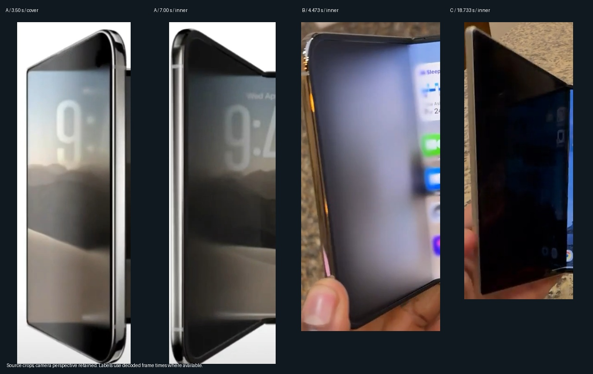

# 0.11 · 세 영상의 화면 평면 재구성

2026-09-11. 사용자는 0.10.3까지의 애니메이션도 세 원본과 너무 다르다고 지적했습니다. 그 지적을 반영해 렌더러의 화면 변형 방식을 바꿨습니다. 이 문서는 영상에서 직접 확인한 사실, 시각 모델의 선택, 실제 센서의 한계를 구분합니다. 원본과 동일하다는 판정은 아닙니다.

## 다시 확인한 세 영상

- `1a0888948391031c.mp4`: 0.5초 간격의 전체 흐름을 다시 보고 3.50초 외부, 7.00초 내부의 원본 해상도 프레임을 확인했습니다. 화면의 물리 테두리는 기울어져 있지만 콘텐츠의 위·아래 경계는 반대편 콘텐츠와 이어지는 방향을 유지합니다. 자유단 쪽에 검은 쐐기가 생깁니다. 선택한 렌더 영상에서 자유단의 위·아래 여백은 보이는 세로 길이의 약 10~12% 수준입니다. 수동 시각 판독이며 정확한 카메라 보정값은 아닙니다.
- `1a088757f121031c.mp4`: 전체 표본과 펼침·접힘 장면을 재확인했습니다. 내부 왼쪽은 흐림과 어두운 가장자리가 함께 나타나고, 고정된 오른쪽은 상대적으로 선명합니다. 약 4.473초에는 밝은 위젯의 색이 넓게 확산돼 보입니다. 외부에서는 오른쪽이 먼저 흐려지며 일부 구간에 왼쪽 아이콘 열이 더 오래 읽힙니다.
- `1a08a212d3350598a.mp4`: 0.25초 간격으로 추출한 전체 108개 표본의 다섯 시트를 다시 확인했습니다. 약 3.233초와 18.733초의 내부 왼쪽에는 큰 어두운 영역과 비대칭 상단 여백이 보입니다. 16.5~19.7초의 느린 움직임과 21.7~25.3초의 빠른 움직임에서 여백·내용 위치·흐림·밝기가 함께 달라집니다. 두 번째 영상보다 어두운 면이 강하게 보이는 장면이 있어 세 영상의 밝기를 하나의 고정 값으로 취급하지 않습니다.

위 이미지는 화면 부분만 잘라 비교한 것입니다. 카메라 원근을 제거하거나 정확한 힌지 각도를 역산한 그림이 아닙니다. 파일의 요청 시각과 디코딩 시각은 기존 `reference-frames/*/frames.json`에 보관돼 있습니다.

## 이전 해석에서 수정한 부분

기존 분석은 물리 패널의 원근을 중복 적용하지 말아야 한다는 데 치우쳐, **패널 안의 콘텐츠 경계가 물리 테두리와 달라지는 현상**을 제대로 구현하지 않았습니다. 기존 작은 변위와 전체 상·하단 그라데이션은 콘텐츠 평면의 변형을 대체하지 못했습니다.

0.11의 `FoldPlane`은 콘텐츠 자체를 사다리꼴 평면으로 그립니다. 내부는 힌지의 위·아래 위치와 오른쪽 화면을 고정하고 왼쪽 자유단의 위·아래·측면을 이동합니다. 외부는 반대 방향으로 적용합니다. 콘텐츠는 원본 해상도에서 projective matrix로 변환되며, 비워진 영역이 실제 검은 쐐기가 됩니다. 그 뒤 공간적으로 다른 Gaussian 확산과 자유단 쪽 음영을 합성합니다. 움직임은 단순한 블러 불투명도 변경이 아닙니다.

미리보기와 전역 오버레이는 같은 렌더러를 사용합니다. 이전의 작은 왜곡 셰이더·격자 근사와 무관한 상하단 검정 그라데이션은 이 렌더러에서 제거했습니다. Gaussian 중간 이미지의 해상도만 외부 1/2, 내부 1/4로 줄이며, 선명한 화면·프로젝션·마스크는 원본 해상도입니다.

## 각도와 기울기 입력

- **펼침 진행:** 기존 사용자가 허용한 주 자이로 Y축 적분 추정과 공개 접힘 끝점으로 얻습니다. 블러 강도와 공간 경계는 전체 진행 구간에 연속으로 반응하며, 평면의 변형은 중간 구간에서 커지고 끝점에서 원래 직사각형으로 돌아옵니다.
- **폰의 자세:** `FoldAttitude`가 자이로 X·Y·Z축을 상대 회전 quaternion으로 적분합니다. 중력 X·Y·Z와 함께 위·아래 여백의 비율, 측면 이동, 자유단 음영에 반영합니다. 같은 펼침 입력이라도 기울기 입력이 다르면 결과가 달라집니다. 90ms 필터로 센서 표본 사이의 변화를 완화합니다.
- **멈춤과 반전:** 움직임을 멈춘 동안 시간을 이유로 펼침 진행을 만들지 않습니다. 같은 자세의 역회전은 현재 자세에서 되돌아옵니다. 끝점에서만 추정 오차를 보정하는 기존 속도·가속도 제한을 유지합니다.
- **미리보기:** 진행도를 손잡이로 고정한 채 실제 폰을 기울여 자세 반응을 확인할 수 있습니다. 실제 기울기 스위치를 끄면 수동 수평 기울기 손잡이를 사용합니다. 손잡이 각도는 실제 힌지 측정값이 아닙니다.

영상에는 센서 기록이 없습니다. 원본이 실제로 어떤 자이로·시선 추적·카메라 보정식을 사용하는지 입증하지 않습니다. 이 구현은 관찰한 모습을 재현하기 위한 모델이며, 센서의 자세는 관찰자의 눈 위치와 같지 않습니다. 주 IMU 하나만으로 양쪽 패널의 상대 각도와 기기 전체 회전을 완전히 분리할 수 없습니다. 최근 실기에서도 물리 끝점과 추정값 사이의 큰 오차가 남았으므로, 새 시각 모델을 실제 각도 정확도의 해결로 취급하지 않습니다.

## 화면 연결 유지

0.8.4 이후의 고정 패널 매핑과 입력 전달, 0.10.2의 GPU 보관 이미지 수명·반전 처리, 대상 크기 확인, 화면 공유 종료·잠금·5분 후 복구를 유지합니다. 임의 앱의 내부·외부 레이아웃을 동시에 독립 실행하는 기능은 아닙니다. 새 시각 모델도 앱이 원래 제공하지 않는 별도의 반쪽 레이아웃을 생성하지 않습니다.

## 검증

- 최종 빌드, Java 테스트 44개, Python 테스트 7개, Android lint 통과. 신규 검증은 내부·외부 힌지 고정, 진행도별 평면의 유효성, 같은 진행도에서 기울기별 여백 변화, X/Y/Z 각 축 반응, 정지·역회전과 센서 공백을 포함합니다.
- 실제 기기의 HardwareBufferRenderer에서 각 방식·패널별 288회 비교했습니다. 최종 최적화 경로의 GPU 렌더 및 완료 대기 중앙값은 외부 3.95ms, 내부 19.95ms, p95는 각각 7.51ms, 26.52ms입니다. 같은 시각 모델의 원본 해상도 Gaussian 경로 중앙값은 외부 7.16ms, 내부 41.75ms였습니다. 전체 앱 FPS나 물리 화면의 부드러움 보장은 아닙니다.
- 0/45/90/135/180° GPU 이미지에서 원본 Gaussian 경로 대비 평균 RGB 차이는 0~0.614/255입니다. 완전히 선명한 끝점은 픽셀이 같고, 내부 정지 면 중앙도 모든 표본 각도에서 픽셀이 같았습니다.
- 같은 진행도를 유지한 채 자세 입력만 세 경우로 바꾼 GPU 출력에서 콘텐츠 형태·검은 여백·음영이 함께 달라지는 것을 확인했습니다. 미리보기에서 두 결과를 연이어 그릴 때 뒤쪽 결과의 배경 지우기가 앞쪽 결과까지 가리던 UI 문제도 실제 스크린샷으로 발견해 영역 그리기로 수정했습니다.
- 설치·보관 APK: `artifacts/poldy-0.11.0-projected-plane.apk`. GPU 근거: `measurements/renderer-v30/report.json`, `attitude-check.json`, `research/plane-study/attitude-comparison.jpg`. 휴대전화 미리보기: `measurements/native-v30-run/preview-fixed.png`.

사용자의 원본 유사성 평가는 아직 진행 중입니다. 미리보기의 진행도는 수동 값이며 전역 센서 추정의 정확도를 입증하지 않습니다.

## 0.11.1 · 접기 시작부터 보이는 흐림

사용자는 0.11.0 시험에서 접기 시작할 때 블러가 너무 약하다고 지적했습니다. 기존 전체 범위 smoothstep 뒤에 확산 마스크의 smoothstep이 겹쳐 작은 움직임의 시각 변화가 매우 약했습니다. 끝점에서 벗어나는 처음 3개의 **시각 입력도**에 26%의 확산 강도를 연속 배분하고, 나머지 74%는 전체 진행에 배분했습니다. 실제 힌지를 3° 단위로 측정한다는 뜻이 아닙니다. 0/180°에서는 여전히 완전히 선명하며, 돌아오는 동작도 같은 곡선을 따릅니다.

빌드·Java 테스트 45개·Android lint 통과. 추가 회귀 검증은 양쪽 패널의 2도 시각 입력에서 확산 강도가 0.19를 넘고, 움직이는 가장자리의 약한 확산층 가중치가 0.3을 넘는지 확인합니다. 별도 GPU 진입 표본 0/1/2/3/6/12에서 실제 흐림 발생을 확인했습니다(`measurements/renderer-v31-entry/entry-comparison.jpg`, `entry-check.json`). 기존 0.11.0의 전체 성능 벤치마크를 새 버전의 실측 FPS라고 재사용하지 않습니다.

최신 설치·보관 APK는 `artifacts/poldy-0.11.1-early-frost.apk`입니다. 15:45경 5분 전역 시험을 다시 시작했습니다. 사용자 체감 결과는 계속 확인합니다.

## 0.11.2 · 검은 여백의 부드러운 경계

사용자가 검은 부분의 경계가 너무 뚜렷하다고 지적했습니다. Gaussian 확산을 합성한 출력 전체를 다시 사다리꼴 경계로 잘라내던 처리를 제거했습니다. 대신 실제 평면의 위·아래·자유단 경계에서 안쪽 거리별로 부드럽게 밝아지는 마스크를 적용합니다. 모서리에서는 세 경계의 부드러운 가중치를 곱해 단단한 각이 드러나지 않게 했습니다.

경계 폭은 패널의 짧은 변 기준 최대 3.5%이며, 펼침 진행에 따른 평면 변형이 사라지면 함께 0으로 줄어듭니다. 힌지 부근에서도 폭을 줄여 내부 오른쪽에 검은 줄이나 잔여 음영이 생기지 않게 했습니다. 앞선 초기 블러 곡선은 유지합니다.

빌드·Java 테스트 45개·Python 테스트 7개·Android lint 통과. 휴대전화 GPU에 생성한 흰색 입력을 넣어 내부·외부 0/2/90/110/178/180° 표본을 확인했습니다. 중간 각도의 경계를 가로지르는 네 밝기 표본에서 43~60단계가 관측됐고, 인접 픽셀의 평균 RGB 변화 최대값은 4~6/255였습니다. 실제 출력에 급격한 밝기 점프가 없는지 확인하는 검증이며 CPU로 셰이더를 다시 계산한 비교가 아닙니다. 내부의 정지 면은 모든 표본에서 원본 흰색 그대로였고, 표시 패널의 완전히 선명한 끝점도 픽셀이 같았습니다.

근거: `measurements/renderer-v32-boundary/boundary-check.json`, `soft-boundary.jpg`. 도구: `tools/boundary_report.py`, instrumentation의 `edgeOnly` 옵션. 최신 APK: `artifacts/poldy-0.11.2-soft-boundary.apk`. 실제 폰을 접는 동안의 체감 확인은 별도로 진행합니다.
